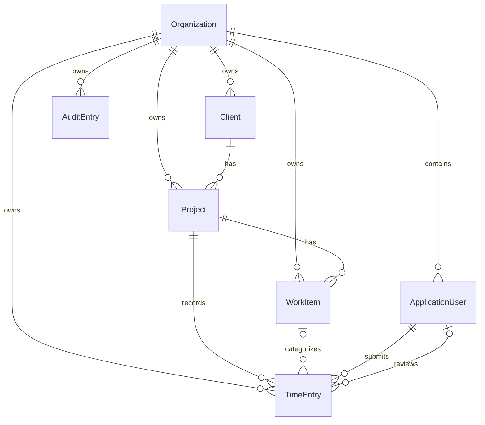

# Vela

Vela is a production-style Blazor operations workspace for small delivery teams. It brings clients, projects, work items, time tracking, approvals, reporting, Excel exports, and audit history into one organization-isolated workspace.

> This is an independent portfolio project. It does not represent a real client deployment or production usage claim.

## Product tour

Screenshot capture slots are prepared for the final portfolio images:

1. Dashboard — KPIs, project-hours chart, activity, and deadlines
2. Projects — client/status filters and budget utilization
3. Project delivery — work items, priorities, ownership, and due dates
4. Time approvals — manager review with approve/reject workflow
5. Reports — server aggregates, paged details, and Excel export

See [the exact screenshot routes and states](docs/screenshots/README.md).

## Live demo

The application is prepared for a public Railway deployment. It can also be run locally with Docker Compose.

## Demo accounts

The public Northstar Studio demo exposes these team accounts:

| Role | Email |
|---|---|
| Manager | `manager@northstar.demo` |
| Manager | `manager2@northstar.demo` |
| Employee | `employee@northstar.demo` |
| Employee | `employee2@northstar.demo` |

When `DemoAccess__Enabled=true`, the sign-in page offers one-click Manager and Employee profiles. The browser never receives the demo password: the server signs in only one of these allow-listed seed accounts using `DemoPassword`. Manual sign-in remains available for the other seeded team accounts. The baseline includes four clients, six projects, 24 work items, 48 time entries, notifications, and recent audit history. Dates are generated relative to the reset date so dashboard and reporting views remain useful.

## Features

- Organization-based data isolation enforced in server-side application services
- ASP.NET Core Identity with Administrator, Manager, and Employee roles
- Server-filtered and server-paged client, project, task, time, report, and audit views
- Project budget utilization based on approved time
- Draft, submit, reject, reopen, resubmit, and approve state transitions
- Self-approval prevention and PostgreSQL optimistic concurrency
- Dashboard KPIs, recent activity, deadlines, and CSS-rendered charts
- Safe `.xlsx` exports with filters, frozen headings, auto-filter, typed dates/numbers, XML sanitization, and formula neutralization
- Audit events for key changes, workflow decisions, and exports
- Responsive, keyboard-visible UI with loading, empty, success, error, 403, and 404 states

## Technology

.NET 10 LTS, ASP.NET Core 10, Blazor Web App with global Interactive Server rendering, ASP.NET Core Identity, EF Core 10, Npgsql, PostgreSQL 17, QuickGrid, Bootstrap 5, Open XML SDK, xUnit, Testcontainers, Docker Compose, and GitHub Actions.

## Architecture

The solution is a modular monolith:

- `Domain` — entities, enums, invariants, and workflow transitions
- `Application` — explicit use-case contracts, DTOs, validation models, permissions, and paging
- `Infrastructure` — PostgreSQL/EF Core, Identity persistence, services, audit, export, migration, and seeding
- `Web` — Blazor UI, authentication endpoints, routes, layout, and dependency composition

Business operations create a short-lived context through `IDbContextFactory<ApplicationDbContext>`. Read queries use `AsNoTracking`, projection, bounded paging, and explicit organization predicates. See [architecture.md](docs/architecture.md) and the [decision log](docs/decisions/).

## Entity model



## Quick start with Docker

Prerequisites: Docker Desktop or a compatible Docker Engine with Compose.

```bash
cp .env.example .env
# Replace both placeholder passwords in .env
docker compose config
docker compose build
docker compose up
```

Open `http://localhost:8080`. The one-shot `migrate` service applies migrations and idempotent demo seeding before the web service starts. The web service restores the pristine demo baseline every day at `DEMO_RESET_HOUR_UTC` (03:00 UTC by default). PostgreSQL data and ASP.NET Core Data Protection keys use separate named volumes, so data and authentication cookies survive web-container replacement.

Reset the demo immediately without deleting the PostgreSQL volume:

```bash
docker compose run --rm migrate --migrate --reset-demo
docker compose restart web
```

The reset truncates only Vela application and Identity tables, preserves `__EFMigrationsHistory`, and recreates the complete demo team and history in one transaction.

## Railway deployment

Railway deploys this repository through the root `Dockerfile`; `railway.json` supplies the build, healthcheck, and restart policy, while `compose.yaml` remains the local-development setup. Create a Railway project, add a managed PostgreSQL service, and deploy the GitHub repository as the application service. In the application service's Raw Editor, configure:

```text
ASPNETCORE_URLS=http://+:${PORT}
ASPNETCORE_FORWARDEDHEADERS_ENABLED=true
ConnectionStrings__DefaultConnection=Host=${{Postgres.PGHOST}};Port=${{Postgres.PGPORT}};Database=${{Postgres.PGDATABASE}};Username=${{Postgres.PGUSER}};Password=${{Postgres.PGPASSWORD}}
DatabaseInitialization__MigrateOnStartup=true
SeedDemoData=true
DemoPassword=<a-strong-server-only-password>
DemoAccess__Enabled=true
DemoReset__Enabled=true
DemoReset__HourUtc=3
DataProtectionKeysPath=/app/keys
```

If the database service has a different Railway service name, replace `Postgres` in the reference variables. Attach one Railway Volume to the application at `/app/keys`, keep one always-on application replica (do not enable Serverless sleeping), and generate a public domain. On the first start Vela applies migrations and creates the baseline; later starts are idempotent. The background reset runs daily at the configured UTC hour and may sign out visitors whose session spans the reset.

## Local development

Prerequisites: .NET SDK 10.0.301 or newer compatible 10.0 SDK, PostgreSQL, and Docker for integration tests.

```powershell
$env:ConnectionStrings__DefaultConnection = "Host=localhost;Port=5432;Database=business_portal;Username=business_portal;Password=<local-password>"
$env:SeedDemoData = "true"
$env:DemoPassword = "<strong-local-demo-password>"
$env:DemoAccess__Enabled = "true"
$env:DemoReset__Enabled = "false"
dotnet tool restore
dotnet restore BusinessPortal.sln
dotnet run --project src/BusinessPortal.Web/BusinessPortal.Web.csproj -- --migrate --seed
dotnet run --project src/BusinessPortal.Web/BusinessPortal.Web.csproj
```

The first `dotnet run` is an explicit migration/seed operation and exits. Startup migration remains disabled by default and is enabled only when `DatabaseInitialization__MigrateOnStartup=true`, as in the Railway demo configuration.

## Migrations

Create a migration:

```bash
dotnet tool run dotnet-ef migrations add <Name> --project src/BusinessPortal.Infrastructure --startup-project src/BusinessPortal.Web --output-dir Migrations
```

Apply it explicitly:

```bash
dotnet run --project src/BusinessPortal.Web -- --migrate
```

For a production deployment, back up the database, run the migration job once with the target connection string, verify it, then start the new web image. `DatabaseInitialization__MigrateOnStartup` and the destructive nightly reset are demo-hosting conveniences and should remain disabled for real customer data.

## Verification

```bash
dotnet restore BusinessPortal.sln
dotnet format BusinessPortal.sln --verify-no-changes --no-restore
dotnet build BusinessPortal.sln --configuration Release --no-restore
dotnet test BusinessPortal.sln --configuration Release --no-build
dotnet list BusinessPortal.sln package --vulnerable --include-transitive
```

Integration tests use a real disposable PostgreSQL 17 container and therefore require a running Docker daemon. The workflow in `.github/workflows/ci.yml` runs the same checks and builds the Docker image without publishing it.

## Security and isolation

Organization IDs and user IDs are obtained from the authenticated server-side identity, never trusted from forms. Every service query is tenant-scoped; manager operations are enforced in application code as well as in page authorization. Public registration is disabled. Cookies are HTTP-only, antiforgery is enabled, exports are bounded, sensitive free text is excluded from audit summaries, and production errors do not expose stack traces.

Read [SECURITY.md](SECURITY.md) for reporting guidance and `docs/risks.md` for known delivery risks.

## Technical decisions

- Modular monolith over distributed services
- Explicit application services over generic repositories and mediator layers
- Stable string enum storage for readable PostgreSQL data
- `DateOnly` for business dates and UTC for events
- `decimal(6,2)` time quantities
- PostgreSQL `xmin` optimistic concurrency for approvals
- Open XML SDK rather than a commercial spreadsheet library

## Demo limitations

- No public signup, invitation administration, password email delivery, billing, attachments, or external identity provider
- Demo seeding and public one-click access are separate, opt-in settings and require server-side environment credentials
- Public demo access is suitable only for isolated fictional data with no production integrations or sensitive information
- The optional nightly reset is destructive by design and must never be enabled against a production database
- Performance results must be measured in the target environment; no production-scale claims are made
- Screenshots and the final portfolio video require a running seeded instance

## License

[MIT](LICENSE.txt)
