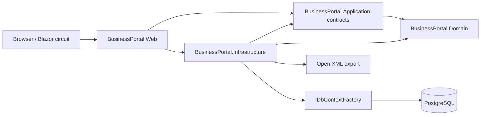

# Architecture

Vela is a modular monolith deployed as one ASP.NET Core process with one PostgreSQL database.

## Request flow

1. ASP.NET Core Identity authenticates the request or circuit.
2. `ICurrentUser` resolves the user, active organization, display name, and roles on the server.
3. A Razor component calls an explicit application service.
4. The service enforces role and ownership rules, creates a short-lived context, and scopes every query by organization.
5. Read paths project directly to DTOs with `AsNoTracking`; lists filter, sort, and page in PostgreSQL.
6. Mutations validate domain transitions and write the business change plus audit event in one `SaveChanges` transaction.

## Boundaries

The Domain project has no EF Core or Blazor dependency. Application contains no persistence implementation. Infrastructure is the only project that knows PostgreSQL, EF Core, Identity persistence, or Open XML. Web owns only UI, authentication presentation, routing, and composition.

## Data isolation

Business forms never expose a trusted `OrganizationId`. The current organization comes from the authenticated `ApplicationUser`; every service predicate includes it. Cross-tenant IDs return not found, avoiding resource disclosure. Organization-scoped unique indexes enforce rules such as project-code uniqueness.

## Concurrency

`TimeEntry.Version` maps to PostgreSQL `xmin`. A review supplies its observed version; a competing review produces `DbUpdateConcurrencyException`, translated to a user-facing conflict.

## Operational model

The web process does not migrate automatically. `--migrate` is an explicit one-shot operation; `--seed` additionally runs opt-in idempotent demo seeding. Compose runs this as a dedicated service before the web container.
